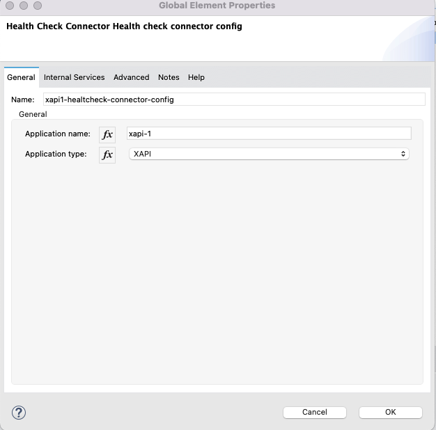
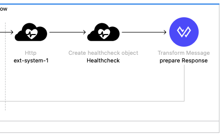

# mule-4-healthcheck-connector

## Release Notes

### v2.0.0
November 6, 2024
### Compatibility

| Software | Version         |
|---------|-----------------|
| Mule Runtime   | 4.6.3 and later |
| Mule JDK | 8 and 17        |
| Maven   | 3.9.7 and later |


### v1.0.0
September 1, 2022
### Compatibility

| Software | Version        |
|---------|----------------|
| Mule Runtime   | 4.3.x and 4.4.x |
| Mule JDK | 8       |
| Maven   | 3.6.3 |

### Repository Structure

* [connector](/connector) : Mule 4 Healthcheck Connector code
* [api-fragments](api-fragments) : Healthcheck API fragments in OAS and RAML 
* [sample-app](sample-app): Demo application
* [README.md](README.md)

    

Drop-in Mule 4 connector that provides a set of operations that can perform a health check to a different set of systems as:
- HTTP services
- Databases
- JMS Brokers
- AMQP Brokers

# Installation

## 1. Deploy to Exchange
Replace groupId in connector/pom.xml with your Anypoint Organization Id and then run the following command:

```sh
mvn -f connector/pom.xml clean deploy
```

## 2. Import the connector

In order to use the connector in a Mule 4 Project you can import it through the "Search in Exchange..." tab in the Mule Palette or add the connector as a maven dependency

```xml
<dependency>
    <groupId>ANYPOINT_ORG_ID</groupId>
    <artifactId>health-check-connector</artifactId>
    <version>1.0.0</version>
    <classifier>mule-plugin</classifier>
</dependency>
```

# Use the connector

## Sample app
A sample Mule 4 application that shows how the connector works is available here 
[sample-app](/sample-app/README.md).

## Healthcheck object
All the processors available will output the following object as a Java Class.
You can see it also with DataSense.

```java
private String name;
private ServiceType type;
private ServiceStatus status;
private Integer time;
private String error;
private List<healthcheck> dependencies;
private List<HealthcheckError> dependenciesErrors;
```
## Configuration
 
|Input field|Note|
|---|---|
|Application name|Name of the service that is using the connector|
|Application type|The service type, it can be one of the followings: XAPI,PAPI,SAPI|




### Overview: Example flow

To give an overview of how the connector works we can use as an example one of the flows of the sample-app,

for a system API called **sapi-1** that wraps an external HTTP service called "ext-system-1".




Code:
```xml
	<healthcheck:health-check-connector-config name="sapi1-healthcheck-connector-config" doc:name="Health Check Connector Health check connector config" doc:id="cb1c2c96-d380-4389-9b19-27adc10c00cf" applicationName="sapi-1" tracking:enable-default-events="false">
	</healthcheck:health-check-connector-config>

	<flow name="sapi-1-healthcheck-flow" doc:id="a6bec4c7-6a2e-48f2-871b-26975efe09f6" >
		
        <http:listener doc:name="/sapi-1/healthcheck" doc:id="1e90429b-1781-40d4-9392-7e4a2bb571e6" config-ref="healthcheck-app-listener" path="/sapi-1/healthcheck"/>

		<healthcheck:http doc:name="ext-system-1" doc:id="e4d5bfc2-5695-40ec-bc3d-fc9c6eb1649f" path="/external-system-1" serviceName="ext-system-1" configRef="external-system-1-http-request"/>

		<healthcheck:create-healthcheck-object doc:name="Healthcheck" doc:id="51986839-3aa8-4e60-93a7-e2af8fe10ff3" config-ref="sapi1-healthcheck-connector-config" services="#[[payload]]" targetValue="#[output application/json --- payload]"/>
		<ee:transform doc:name="prepare Response" doc:id="abb15ecb-287b-427c-b1f6-dd7f4c65d6be" >
			<ee:message >
				<ee:set-payload ><![CDATA[  %dw 2.0
                                            output application/json
                                            import * from modules::healthcheckConnectorModule
                                            ---
                                            {
                                                data: formattedhealthcheck(payload)
                                                
                                            }]]>
                </ee:set-payload>
			</ee:message>
		</ee:transform>
	</flow>
```

1. The healthcheck:http processor performs a call to the ext-system and returns as output in the payload a Java object:
```java
Healthcheck{
    name='ext-system-1', 
    type=HTTP, 
    status=HEALTHY, 
    time=405, 
    error='', 
    dependencies=null, 
    dependenciesErrors=null}
```

2. Then the output is passed as input for the dependencies field of the healthcheck:create-healthcheck-object that will return as output in the payload a Java object:
```java
## application/java
Healthcheck{
    name='sapi-1',
    type=SAPI,
    status=HEALTHY,
    time=351, error='null',
    dependencies=[
        healthcheck{
            name='ext-system-1', 
            type=HTTP, 
            status=HEALTHY, 
            time=351, 
            error='', 
            dependencies=[], 
            dependenciesErrors=[]
            }
        ],
    dependenciesErrors=[]
}
```

3. In the last processor, we format the output using a dataweave utility function provided with the connector that formats the output.

```dwl
%dw 2.0
output application/json
import * from modules::healthcheckConnectorModule
---
formattedhealthcheck(payload)
```

4. The final output would be the following:

```json
{
    "name": "sapi-1",
    "type": "SAPI",
    "status": "HEALTHY",
    "time": 200,
    "error": null,
    "dependencies": [
        {
            "name": "ext-system-1",
            "type": "HTTP",
            "status": "HEALTHY",
            "time": 200,
            "error": "",
            "dependencies": [],
            "dependenciesErrors": []
        }
    ],
    "dependenciesErrors": []
}

```

## Functional Monitoring

A sample BAT code to use in the [Anypoint Functional Monitoring][https://docs.mulesoft.com/api-functional-monitoring/afm-in-anypoint-platform]

```
import * from bat::BDD
import * from bat: :Assertions
fun healthcheckStatusMessage(hc) = do {
    var depsErrorsSize = sizeOf(hc.dependenciesErrors)
    var depsErrorsStringList = hc.dependenciesErrors.name joinBy ","
    ---
    if(depsErrorsSize > @ ) ("The following services are unhealthy: " ++ depsErrorsStringList)
    else "ALL services are up!"
}
---
suite("healthcheck-app") in [
it should "Assert endpoint: " in [
GET ‘https: //healthcheck-demo-app/api/healthcheck with {
    “headers": {}
} assert [
$.response.status mustEqual 200,
healthcheckStatusMessage($. response. body.data) mustMatch "All services are up!"
```


