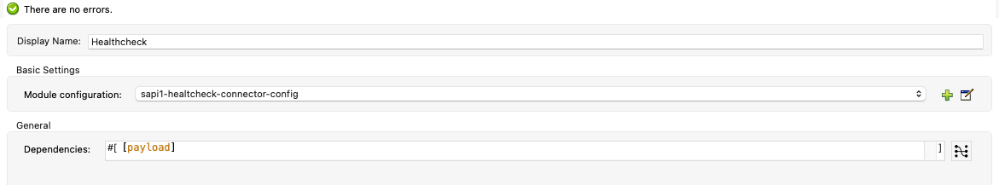

# mule-4-healthcheck-connector
## Operations

### healthcheck:create-healthcheck-object

It creates the object from the connector configuration and a list of dependencies performing some logic:
- bubbling up of the dependencies errors
- computation of the time as the maximum time of the dependencies
- set of HEALTHY/UNHEALTHY in the "status" field

|Parameter|Note|
|---|---|
|Dependencies|List of Healthcheck objects that represent the dependencies of the service|

### healthcheck:http

Performs an HTTP request with the specified parameters in the input and returns a Healthcheck object based on the outcome of the response.

|Parameter|required|Note|
|---|---|---|
|Service Name|true|Name of the service|
|HTTP Module Configuration|true|Indicates which HTTP request configuration should be used with this healthcheck.|
|Method|true|HTTP method to perform on external system|
|Path|true|Path where the request will be sent|
|Headers|false|HTTP headers the message should include.|
|URI Params|false|URI parameters that should be used to create the request.|
|Http query params|false|Query parameters that the request should include.|

### healthcheck:db

Executes the query specified as a parameter and returns a Healthcheck object based on the outcome of the response.

|Parameter|required|Note|
|---|---|---|
|Service Name|true|Name of the service|
|DB Module Configuration|true|Indicates which DB configuration should be used with this healthcheck.|
|SQL Query Text|true|The query to be executed|

### healthcheck:jms

Performs the following actions on a specified queue:
- publish a message
- consume the message

and returns a Healthcheck Object based on the outcome of the response.

|Parameter|required|Note|
|---|---|---|
|Service Name|true|Name of the service|
|JMS Module Configuration|true|Indicates which JMS configuration should be used with this healthcheck.|
|Queue Destination|true|The queue to be used for performing healthcheck|

### healthcheck:amqp

Performs an HTTP call to the services specified in the "Internal Services" tab in the Healthcheck configuration:
- publish a message
- consume the message

and returns a Healthcheck object based on the outcome of the response.

|Parameter|required|Note|
|---|---|---|
|Service Name|true|Name of the service|
|AMQP Module Configuration|true|Indicate which AMQP configuration should be used with this healthcheck.|
|Exchange Name|true|The exchange to be used to perform the healthcheck|
|Queue Destination|true|The queue to be used to perform the healthcheck|

### healthcheck:internal-Services

Performs an HTTP call to the services specified in the "Internal Services" tab in the Healthcheck configuration and returns a list of Healthcheck object for each of them.

|Parameter|required|Note|
|---|---|---|
|applyCustomMapping|true| Flag to enable the use of the script specified in custom-mapping parameter should be used to extract the Healthcheck object from internal services|
|Enable|true|whether the script specified in custom-mapping parameter should be used to extract the Healthcheck object from internal services|
|custom-mapping|true|Dataweave script to extract the Healthcheck object from internal services |

### healthcheck:hc-scope
A custom scope that returns a Healthcheck Object based on the outcome of the processor contained.

|Parameter|required|Note|
|---|---|---|
|Service Name|true|Name of the service|
|Service Type|true|Type of the service|

